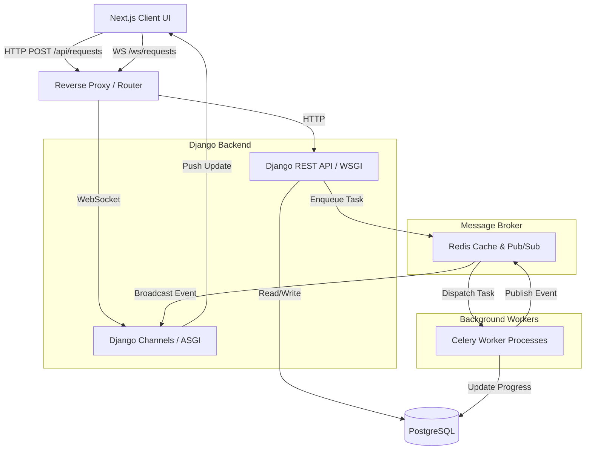
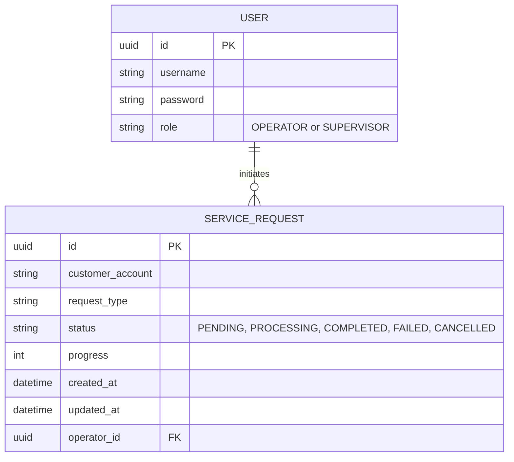
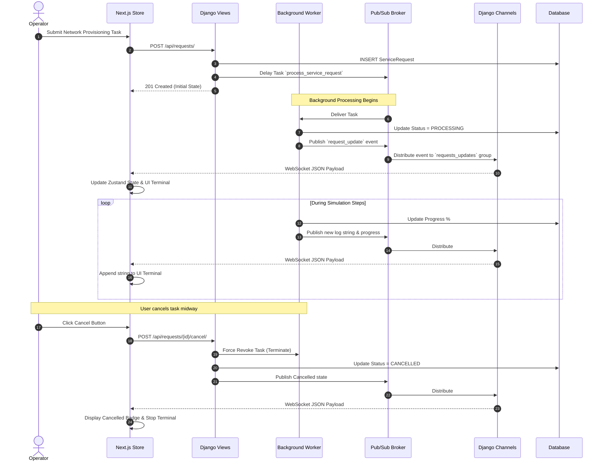

# Architecture Diagrams

## 1. High-Level Component Architecture

```mermaid
graph TD
    Client[Next.js Client UI]
    Nginx[Reverse Proxy / Router]
    
    subgraph Django Backend
        API[Django REST API / WSGI]
        WS[Django Channels / ASGI]
    end
    
    subgraph Message Broker
        Redis[Redis Cache & Pub/Sub]
    end
    
    subgraph Background Workers
        Celery[Celery Worker Processes]
    end
    
    Database[(PostgreSQL)]

    Client -- HTTP POST /api/requests --> Nginx
    Client -- WS /ws/requests --> Nginx
    
    Nginx -- HTTP --> API
    Nginx -- WebSocket --> WS
    
    API -- Read/Write --> Database
    API -- Enqueue Task --> Redis
    
    Redis -- Dispatch Task --> Celery
    Celery -- Update Progress --> Database
    Celery -- Publish Event --> Redis
    
    Redis -- Broadcast Event --> WS
    WS -- Push Update --> Client
```

## 2. Entity Relationship Diagram (ERD)

```mermaid
erDiagram
    USER {
        uuid id PK
        string username
        string password
        string role "OPERATOR or SUPERVISOR"
    }
    
    SERVICE_REQUEST {
        uuid id PK
        string customer_account
        string request_type
        string status "PENDING, PROCESSING, COMPLETED, FAILED, CANCELLED"
        int progress
        datetime created_at
        datetime updated_at
        uuid operator_id FK
    }

    USER ||--o{ SERVICE_REQUEST : "initiates"
```

## 3. Real-Time Event Flow (Sequence Diagram)

```mermaid
sequenceDiagram
    autonumber
    actor Operator
    participant UI as Next.js Store
    participant API as Django Views
    participant Celery as Background Worker
    participant Redis as Pub/Sub Broker
    participant WS as Django Channels

    Operator->>UI: Submit Network Provisioning Task
    UI->>API: POST /api/requests/
    API->>Database: INSERT ServiceRequest
    API->>Redis: Delay Task `process_service_request`
    API-->>UI: 201 Created (Initial State)
    
    Note over Celery,Redis: Background Processing Begins
    Redis->>Celery: Deliver Task
    Celery->>Database: Update Status = PROCESSING
    Celery->>Redis: Publish `request_update` event
    Redis->>WS: Distribute event to `requests_updates` group
    WS-->>UI: WebSocket JSON Payload
    UI->>UI: Update Zustand State & UI Terminal
    
    loop During Simulation Steps
        Celery->>Database: Update Progress %
        Celery->>Redis: Publish new log string & progress
        Redis->>WS: Distribute
        WS-->>UI: WebSocket JSON Payload
        UI->>UI: Append string to UI Terminal
    end

    Note over Operator, Celery: User cancels task midway
    Operator->>UI: Click Cancel Button
    UI->>API: POST /api/requests/{id}/cancel/
    API->>Celery: Force Revoke Task (Terminate)
    API->>Database: Update Status = CANCELLED
    API->>Redis: Publish Cancelled state
    Redis->>WS: Distribute
    WS-->>UI: WebSocket JSON Payload
    UI->>UI: Display Cancelled Badge & Stop Terminal
```
