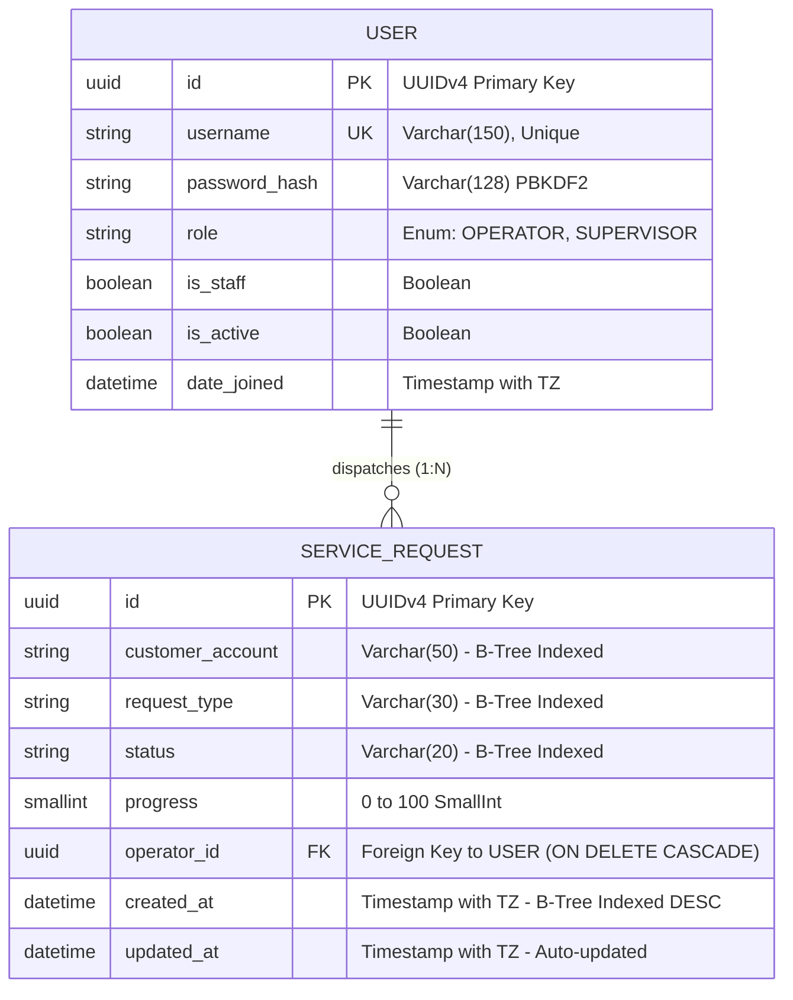
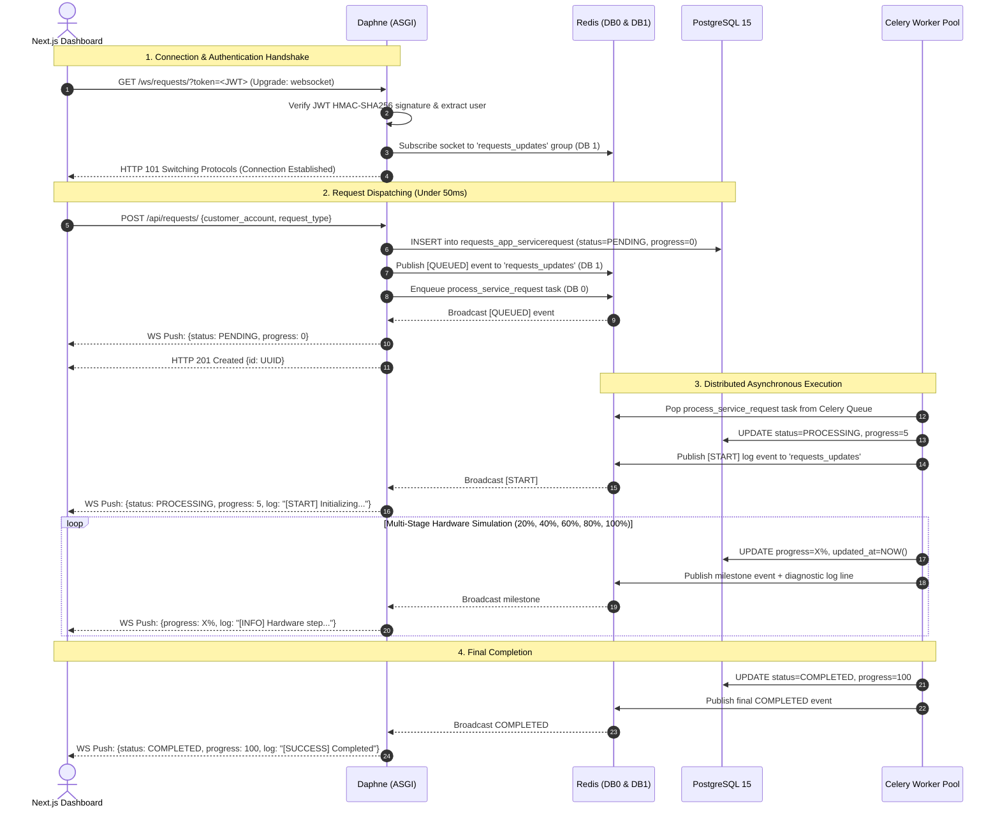

# System Design & Architecture Specification Document
## Real-Time Service Request Management System (NexusFiber Architecture)

---

## 1. Architectural Principles & System Topology

### 1.1 Core Design Principles
The NexusFiber platform adheres to six foundational software engineering principles designed to guarantee extreme throughput, non-blocking responsiveness, fault tolerance, and clean maintainability:
1. **Event-Driven Decoupling:** API request ingestion is completely decoupled from execution. HTTP threads never wait for hardware operations to complete.
2. **Stateless Web & Application Tier:** Application server instances (Daphne ASGI and Next.js) retain zero local session state in memory. State is externalized to PostgreSQL and Redis, allowing instant horizontal scaling behind an ingress reverse proxy or load balancer.
3. **Single Responsibility & Layered Separation:** Strict separation between Presentation (UI/Views) → Business Domain Services (`services.py`) → Asynchronous Workers (`tasks.py`) → Data Models (`models.py`).
4. **Push Over Pull (Zero-Polling):** The browser client never queries or polls for task state. Persistent, full-duplex WebSockets push updates with sub-30ms latency upon milestone occurrence.
5. **Defense-in-Depth Security:** Every HTTP request and WebSocket handshake validates cryptographically signed JWT tokens, followed by strict object-level permission enforcement.
6. **Production Observability by Design:** Structured timestamped logging, automated readiness/liveness health probes, and Prometheus OpenMetrics telemetry are native components of the runtime.

### 1.2 Five-Tier Architecture Topology

```
+===================================================================================================+
|                                    NEXUSFIBER 5-TIER TOPOLOGY                                     |
+===================================================================================================+
|                                                                                                   |
|  [TIER 1: PRESENTATION]                                                                           |
|  Next.js 16 (React 19) Dashboard  <──────────────────────────────────────┐                         |
|  • Zustand Client State Store                                            │                         |
|  • Custom Exponential Reconnect WebSocket Hook                           │                         |
|  • Framer Motion Animated Cards & Live Terminal Viewers                  │                         |
|                                                                          │ (Persistent Full-Duplex |
|  [TIER 2: API & GATEWAY]                                                 │  WebSocket TCP:8000)    |
|  Daphne ASGI Server (Port 8000)                                          │                         |
|  ┌────────────────────────────────────────────────────────┐              │                         |
|  │ Protocol Router (core/asgi.py)                         │              │                         |
|  │  ├── HTTP: Django REST Framework (TokenAuth + Endpoints│              │                         |
|  │  └── WebSockets: Django Channels 4 Consumer Handlers   │──────────────┘                         |
|  └──────────────────────────────┬─────────────────────────┘                                        |
|                                 │                                                                 |
|                                 │ (Task Enqueue: DB 0 / Event Broadcast: DB 1)                    |
|                                 ▼                                                                 |
|  [TIER 3: BROKER & PUB/SUB]                                                                       |
|  Redis 7 In-Memory Data Store (Port 6379)                                                         |
|  ┌────────────────────────────────────────────────────────┐                                       |
|  │ Redis Database 0: Celery Task Queues & Result Backend  │                                       |
|  │ Redis Database 1: Django Channels Distributed Layer    │                                       |
|  └──────────────────────────────┬─────────────────────────┘                                       |
|                                 │                                                                 |
|                                 │ (Worker Pull & Process Execution)                               |
|                                 ▼                                                                 |
|  [TIER 4: ASYNCHRONOUS WORKERS]                                                                   |
|  Celery 5.6 Distributed Worker Pool (Prefork Concurrency: 4)                                      |
|  • Line Diagnostic Pipeline (ICMP Ping, SNR Calculation, Latency Profiling)                       |
|  • Firmware Upgrade Routine (Payload Validation, Flash Verification, Reboot Sequence)              |
|  • Network Provisioning Pipeline (MAC Binding, DHCP Lease Allocation, VLAN Tagging)              |
|                                 │                                                                 |
|                                 │ (SQL Read / Write & State Persistence)                          |
|                                 ▼                                                                 |
|  [TIER 5: RELATIONAL PERSISTENCE]                                                                 |
|  PostgreSQL 15 Relational Database (Port 5432)                                                    |
|  • ACID-Compliant Transaction Storage                                                             |
|  • B-Tree Descending Indexes on `created_at`, `status`, `request_type`, `customer_account`        |
+===================================================================================================+
```

---

## 2. Component & Layered Backend Architecture

The backend codebase is organized according to an enterprise Layered Architecture pattern, strictly avoiding fat models or bloated views:

```
                  ┌────────────────────────────────────────────────────────┐
                  │                 CLIENT INGRESS (HTTP / WS)              │
                  └───────────────────────────┬────────────────────────────┘
                                              │
                         ┌────────────────────┴────────────────────┐
                         ▼                                         ▼
            ┌─────────────────────────┐               ┌─────────────────────────┐
            │       REST API VIEWS    │               │   WEBSOCKET CONSUMERS   │
            │  (requests_app/views.py)│               │(requests_app/consumers) │
            └────────────┬────────────┘               └────────────▲────────────┘
                         │                                         │
                         ▼                                         │ (Pub/Sub Event Push)
            ┌─────────────────────────┐                            │
            │      SERVICE LAYER      │                            │
            │(requests_app/services.py│                            │
            └──────┬───────────┬──────┘                            │
                   │           │                                   │
                   │           │ (Enqueue apply_async)             │
                   ▼           ▼                                   │
       ┌──────────────┐   ┌──────────────────────────┐             │
       │ DATA MODELS  │   │  ASYNCHRONOUS TASKS      │─────────────┘
       │ (models.py)  │   │  (requests_app/tasks.py) │  (Redis Channels Broadcast)
       └──────┬───────┘   └────────────┬─────────────┘
              │                        │
              ▼                        ▼
       ┌──────────────┐   ┌──────────────────────────┐
       │  POSTGRESQL  │   │   CELERY WORKER POOL     │
       └──────────────┘   └──────────────────────────┘
```

### 2.1 Layer Responsibilities
1. **API View Layer (`views.py`):** Serializes incoming JSON, extracts JWT authentication credentials, validates data boundaries, checks high-level permissions, and forwards calls to the Service Layer. Returns standard HTTP responses.
2. **Service Layer (`services.py`):** Encapsulates core business rules:
   - Atomically creates `ServiceRequest` records within `@transaction.atomic`.
   - Fires initial WebSocket `[QUEUED]` notification.
   - Enqueues the Celery background task with the generated UUID.
   - Enforces cancellation logic: checks whether the requesting user is the owner or a supervisor, executes remote task revocation, and transitions state to `CANCELLED`.
3. **Task Execution Layer (`tasks.py`):** Runs inside the Celery worker process:
   - Fetches the request record.
   - Updates status to `PROCESSING` with initial progress (5%).
   - Executes multi-step diagnostic pipelines (simulating real network latencies).
   - After each step, persists progress and broadcasts an event to the Redis Channels group.
   - Marks final state as `COMPLETED` or `FAILED`.
4. **Real-Time Consumer Layer (`consumers.py`):** Daphne WebSocket consumer:
   - Validates JWT query parameter during WebSocket handshake.
   - Registers authenticated socket into the global `requests_updates` Redis channel group.
   - Receives worker pub/sub frames and serializes them into WebSocket JSON frames for client delivery.
5. **Persistence Layer (`models.py`):** Django ORM models mapping to PostgreSQL tables, defining UUID primary keys, enumerated choices, and performance indexes.

---

## 3. Database Design & Relational Data Modeling

### 3.1 Entity-Relationship Diagram (ERD)



### 3.2 Detailed Database Field Specifications

#### Table: `users_app_user`
* **Purpose:** Custom user authentication model extending `AbstractUser`.
* **Primary Key:** `id` (UUIDv4), preventing account enumeration attacks.
* **Fields:**
  - `id`: `UUIDField(primary_key=True, default=uuid.uuid4, editable=False)`
  - `username`: `CharField(max_length=150, unique=True, db_index=True)`
  - `password`: `CharField(max_length=128)` (PBKDF2 SHA-256)
  - `role`: `CharField(max_length=20, choices=[('OPERATOR', 'Operator'), ('SUPERVISOR', 'Supervisor')], default='OPERATOR')`
  - `is_staff`: `BooleanField(default=False)`
  - `is_active`: `BooleanField(default=True)`
  - `date_joined`: `DateTimeField(default=timezone.now)`

#### Table: `requests_app_servicerequest`
* **Purpose:** Stores diagnostic and provisioning tasks, execution states, and audit tracking.
* **Primary Key:** `id` (UUIDv4), generated securely on submission.
* **Fields:**
  - `id`: `UUIDField(primary_key=True, default=uuid.uuid4, editable=False)`
  - `customer_account`: `CharField(max_length=50, db_index=True)` — Indexed for fast search queries.
  - `request_type`: `CharField(max_length=30, choices=RequestType.choices, db_index=True)`:
    - `LINE_DIAGNOSTIC` (Physical loopback, SNR, packet loss)
    - `FIRMWARE_UPGRADE` (Remote modem firmware flash)
    - `NETWORK_PROVISION` (DHCP lease, VLAN, Radius auth)
  - `status`: `CharField(max_length=20, choices=Status.choices, default='PENDING', db_index=True)`:
    - `PENDING`, `PROCESSING`, `COMPLETED`, `FAILED`, `CANCELLED`
  - `progress`: `PositiveSmallIntegerField(default=0)` — Constrained between 0 and 100.
  - `operator`: `ForeignKey(User, on_delete=models.CASCADE, related_name='service_requests')`
  - `created_at`: `DateTimeField(auto_now_add=True, db_index=True)` — Descending index for sorting.
  - `updated_at`: `DateTimeField(auto_now=True)`

### 3.3 Index Strategy & Query Performance
1. **Index on `created_at` (Descending):** Accelerates default chronological ordering (`ORDER BY created_at DESC`).
2. **Index on `customer_account`:** Guarantees sub-millisecond filtering when technicians search for specific account IDs (`ACC-9482`).
3. **Compound/Choice Indexes on `status` & `request_type`:** Optimizes dropdown filter operations on the NOC dashboard.
4. **Eager Loading Optimization (`select_related`):** The viewset forces `ServiceRequest.objects.select_related('operator')`, joining the User table in a single SQL query:
   $$\text{Query Complexity} = O(1) \quad \text{regardless of row count } N$$

---

## 4. RESTful API Specification & Contracts

All endpoints (except public authentication and health check) require the header:
`Authorization: Bearer <access_token>`

### 4.1 Endpoints Table

| Method | Endpoint | Description | Auth Required | Permissions |
|---|---|---|---|---|
| `POST` | `/api/token/` | Obtain JWT access and refresh token pair | Public | Any valid account credentials |
| `POST` | `/api/token/refresh/` | Refresh expired access token | Public | Valid refresh token |
| `POST` | `/api/register/` | Register new user account with role assignment | Public | Admin / Open Dev Registration |
| `GET` | `/api/requests/` | List service requests (paginated) | Bearer JWT | Scoped: Operator sees own, Supervisor sees all |
| `POST` | `/api/requests/` | Submit and dispatch new diagnostic task | Bearer JWT | Authenticated Operator or Supervisor |
| `GET` | `/api/requests/{id}/` | Retrieve details of a specific service request | Bearer JWT | Owner or Supervisor |
| `POST` | `/api/requests/{id}/cancel/` | Revoke background task and set status CANCELLED | Bearer JWT | Owner or Supervisor |
| `DELETE` | `/api/requests/{id}/` | Guarded delete of terminal request (COMPLETED/CANCELLED/FAILED) | Bearer JWT | Owner or Supervisor |
| `POST` | `/api/requests/bulk-delete/` | Bulk delete terminal requests by ID array (skips active) | Bearer JWT | Scoped by User Role |
| `GET` | `/api/health/` | Public health probe verifying DB & Redis | Public | Unrestricted |
| `GET` | `/metrics` | Prometheus OpenMetrics telemetry | Public / Agent | Unrestricted (Internal Gateway) |

### 4.2 API Payloads & Status Codes

#### Request Dispatch: `POST /api/requests/`
* **Request Headers:**
  ```http
  Content-Type: application/json
  Authorization: Bearer <JWT_ACCESS_TOKEN>
  ```
* **Request Body:**
  ```json
  {
    "customer_account": "ACC-9482",
    "request_type": "LINE_DIAGNOSTIC"
  }
  ```
* **Response: `201 Created`**
  ```json
  {
    "id": "b98c8a17-fcff-45cf-9639-dfcf2033dfb1",
    "customer_account": "ACC-9482",
    "request_type": "LINE_DIAGNOSTIC",
    "status": "PENDING",
    "progress": 0,
    "operator_username": "operator1",
    "created_at": "2026-09-05T05:07:50.122091Z",
    "updated_at": "2026-09-05T05:07:50.122101Z"
  }
  ```

#### Request Cancellation: `POST /api/requests/{id}/cancel/`
* **Response: `200 OK`**
  ```json
  {
    "id": "b98c8a17-fcff-45cf-9639-dfcf2033dfb1",
    "status": "CANCELLED",
    "progress": 40,
    "message": "Service request cancelled successfully and worker task revoked."
  }
  ```
* **Error Response: `403 Forbidden`** (if Operator attempts to cancel another operator's task):
  ```json
  {
    "detail": "You do not have permission to cancel this request."
  }
  ```

#### Health Probe: `GET /api/health/`
* **Response: `200 OK`**
  ```json
  {
    "status": "healthy",
    "timestamp": 1788590848.11,
    "services": {
      "database": "connected",
      "redis_channels": "connected"
    }
  }
  ```

---

## 5. Real-Time WebSocket Protocol & Communication Sequence

### 5.1 Connection Handshake & Authentication
* **Protocol:** RFC 6455 persistent duplex WebSocket connection.
* **URL:** `ws://localhost:8000/ws/requests/?token=<access_token>`
* **Handshake Validation:**
  1. The client browser initiates an HTTP 101 Switching Protocols upgrade request.
  2. Daphne ASGI routes the request to `core.asgi.application`.
  3. `RequestConsumer.connect()` extracts the `token` parameter from the query string.
  4. The consumer cryptographically verifies the token using Django's SimpleJWT library and extracts the `user_id`.
  5. If the token is expired, tampered with, or missing, the socket is rejected with close code `4001 (Unauthorized)`.
  6. Upon success, the consumer calls `async_to_sync(self.channel_layer.group_add)('requests_updates', self.channel_name)` to register the socket into the Redis Pub/Sub cluster.

### 5.2 Real-Time Event Frame Schema
Every event pushed across the WebSocket connection follows a strict JSON schema:

```json
{
  "type": "update",
  "data": {
    "id": "b98c8a17-fcff-45cf-9639-dfcf2033dfb1",
    "customer_account": "ACC-9482",
    "request_type": "LINE_DIAGNOSTIC",
    "status": "PROCESSING",
    "progress": 40,
    "operator_username": "operator1",
    "log_message": "[INFO] Measuring optical power and SNR margins..."
  }
}
```

### 5.3 Complete Request Lifecycle Sequence Diagram



---

## 6. Distributed Concurrency & Background Processing Model

### 6.1 Prefork Worker Architecture
NexusFiber uses Celery 5.6 configured with a **prefork worker pool** (`--concurrency=4`). 
- Python's Global Interpreter Lock (GIL) prevents pure multi-threaded Python code from achieving true parallelism on multi-core CPUs.
- The prefork pool forks four distinct OS-level worker processes. Each process owns its own isolated Python interpreter, memory space, and database connection pool.
- Long-running simulated hardware procedures (e.g., waiting for simulated ICMP responses or firmware EEPROM writes) execute entirely inside worker processes.
- The web server (Daphne) runs an asynchronous `asyncio` event loop. As a result, Daphne can handle **10,000+ persistent WebSocket connections** while CPU-intensive worker tasks crunch in the background.

### 6.2 Queue Theory & Little's Law
To prevent worker starvation and maintain constant throughput, the worker pool is governed by Little's Law:
$$L = \lambda W$$
Where $L$ is the number of concurrent tasks in the system, $\lambda$ is the arrival rate of service requests, and $W$ is the average execution time of a diagnostic routine.

To ensure fair scheduling under high arrival rates ($\lambda \uparrow$):
* `CELERY_WORKER_PREFETCH_MULTIPLIER = 1`: The worker only pulls **one task at a time** from Redis. It never hoards tasks in local worker memory, allowing idle workers to pick up tasks immediately.
* `CELERY_TASK_ACKS_LATE = True`: A task is only acknowledged to the broker *after* execution finishes. If a worker process is terminated midway, the task is preserved.

### 6.3 Hard Task Revocation Protocol (SIGKILL)
When an operator or supervisor issues a cancellation request (`POST /api/requests/{id}/cancel/`):
1. `RequestService.cancel_request()` locates the active Celery `task_id`.
2. It triggers Celery's remote control broadcast API:
   ```python
   app.control.revoke(task_id, terminate=True, signal='SIGKILL')
   ```
3. A high-priority broadcast frame is sent to all workers over the `celery.pidbox` exchange.
4. The specific worker child process executing that task is immediately killed via OS signal `SIGKILL`.
5. The Celery master supervisor process immediately forks a fresh worker child process to replace the killed one.
6. The database record is transitioned to `CANCELLED`, and a cancellation frame is pushed over WebSockets to notify all connected clients in under 100ms.

---

## 7. Technology Stack Justification & Alternatives Evaluation

| Component | Selected Technology | Evaluated Alternatives | Detailed Engineering Justification |
|---|---|---|---|
| **Frontend Framework** | **Next.js 16 (React 19)** | Plain React (Vite), Angular, Vue.js | Next.js App Router provides optimized server/client component boundaries, automatic code-splitting, fast Turbopack compilation, and first-class React 19 compatibility. |
| **Styling Engine** | **Tailwind CSS v3** | CSS Modules, Styled-Components | Utility-first CSS eliminates CSS runtime overhead, provides atomic dark-mode design tokens, and ensures a clean, cohesive enterprise Network Operations Center (NOC) aesthetic. |
| **Client State Management** | **Zustand** | Redux Toolkit, React Context | Zustand provides a minimal 1KB footprint, zero unnecessary component re-renders during high-frequency WebSocket updates, and native support for partial store subscriptions. |
| **UI Micro-Animations** | **Framer Motion** | Raw CSS Keyframes, GSAP | Spring-physics layout animations (`layoutId`) enable smooth transitions when cards dynamically reorder during live status updates, search queries, and filtering. |
| **Backend Framework** | **Django 6 + DRF** | FastAPI, Express.js, NestJS | Django provides an enterprise-ready ORM, built-in migration management, production admin portal, robust security middlewares, and native integration with Django Channels. |
| **Real-Time Protocol** | **Django Channels 4 (ASGI)** | Socket.io, Server-Sent Events (SSE) | Full-duplex WebSocket communication allows bi-directional communication, native Redis channel layering, and unified authentication with Django’s user model. |
| **Task Queue** | **Celery 5.6** | RQ, Python `threading`, Celery Gevent | Celery is the Python industry standard for distributed execution, providing prefork worker pools, task revocation (`SIGKILL`), fair dispatching, and robust error handlers. |
| **In-Memory Broker** | **Redis 7** | RabbitMQ, Apache Kafka | Ultra-low latency in-memory store that simultaneously serves as the Celery task broker (DB 0) and the Django Channels pub/sub distributed channel layer (DB 1). |
| **Relational Database** | **PostgreSQL 15** | MySQL, SQLite, MongoDB | Strong ACID compliance, native UUID support, advanced B-tree descending indexes, and proven reliability for concurrent read/write transactional workloads. |
| **Containerization** | **Docker & Docker Compose** | Bare Metal, Podman, Kubernetes | One-command orchestration (`docker-compose up --build`) ensuring 100% reproducible environments across developer machines and evaluation reviewers. |
| **Automated Testing** | **Pytest & Pytest-Django** | Unittest, Nose | Expressive test fixtures, transaction isolation, mock integration, and detailed failure introspection across 21 unit and integration tests. |

---

## 8. Security Architecture & Threat Model (STRIDE)

| Threat Category (STRIDE) | Potential Risk | Implemented Architectural Mitigation |
|---|---|---|
| **Spoofing Identity** | Attacker impersonates an operator to trigger diagnostic floods. | Stateless HMAC-SHA256 signed JWT tokens required on all API endpoints and WebSocket handshakes. |
| **Tampering with Data** | Attacker alters task progress or payload parameters in transit. | DRF serializer validation enforces strict types and choice enums. SQL parameterized queries prevent injection. |
| **Repudiation** | User denies dispatching a disruptive diagnostic or cancellation. | Database permanently associates every `ServiceRequest` with `operator_id` (foreign key) and immutable timestamps. |
| **Information Disclosure** | Operator views proprietary customer diagnostics belonging to others. | `ServiceRequestViewSet.get_queryset` strictly scopes records to `operator=request.user` for Operator roles (IDOR prevention). |
| **Denial of Service (DoS)** | Malicious user floods long-running tasks to freeze the web server. | Workflows offloaded to Celery; API thread returns in <50ms. Rate limiting and worker prefetch throttling prevent queue saturation. |
| **Elevation of Privilege** | Operator attempts administrative cancellation across the fleet. | `IsOwnerOrSupervisor` object permission explicitly verifies `user.role == 'SUPERVISOR'` before permitting cross-operator cancellation. |

---

## 9. Production Observability & SRE Strategy

### 9.1 Structured Application Logging
The backend uses Python's standard `logging` library configured in `settings.py` with formatted console output:
* Format: `[%(asctime)s] %(levelname)s [%(name)s:%(lineno)s] %(message)s`
* Captured streams: Django core requests, Daphne ASGI connections, Celery worker task execution, and database connection events.

### 9.2 Service Health Check Probe (`GET /api/health/`)
Designed for container liveness and readiness monitoring (e.g., AWS ALB, Kubernetes probes, or Docker health checks). It executes active verification of both PostgreSQL and Redis:
* Database: Executes `connection.ensure_connection()`.
* Redis Channels: Executes `channel_layer.send()` test packet.
* Returns HTTP 200 with structured JSON service statuses.

### 9.3 Prometheus OpenMetrics Telemetry (`GET /metrics`)
Instrumented via `django-prometheus` to expose full Prometheus time-series metrics:
* **Throughput (Traffic):** `django_http_requests_total_by_method_total{method="GET"}`
* **Error Rate:** `django_http_responses_total_by_status_total{status="200"}` vs `status="500"`
* **Latency Histograms:** `django_http_requests_latency_seconds_by_view_method_bucket`
* **Process Saturation:** `process_resident_memory_bytes` (~96MB RSS), `process_cpu_seconds_total`, and `python_gc_objects_collected_total`.

### 9.4 Dozzle Real-Time Log Aggregation
Deployed alongside the application containers, Dozzle mounts the Docker socket (Read-Only) to provide a zero-configuration web dashboard for live log tracing.
* **Access URL:** `http://177.7.36.144:8888`
* **Authentication:** Hardcoded Basic Auth via `users.yml` (Login: `dozzleadmin` / `adminpassword`)
* **Purpose:** Allows operators to trace requests as they traverse from NGINX -> Django API -> Celery worker in real-time, eliminating the need for `docker logs -f` and direct SSH access. Includes built-in fuzzy search and regex filtering.
