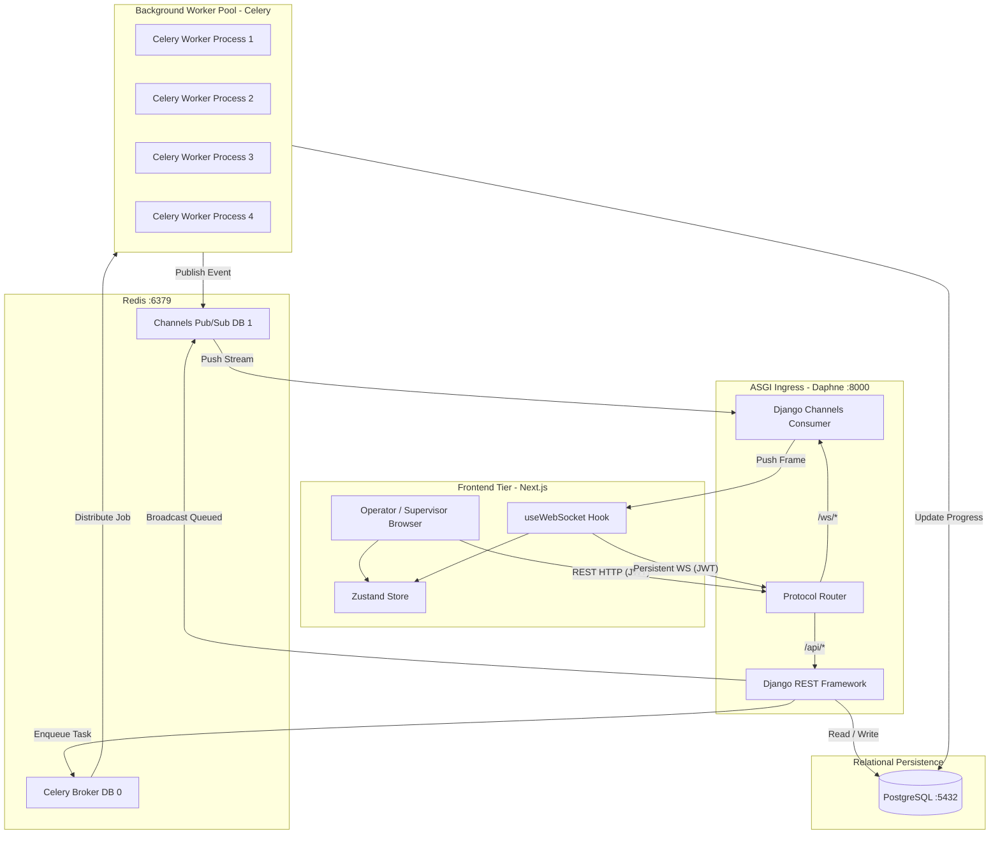
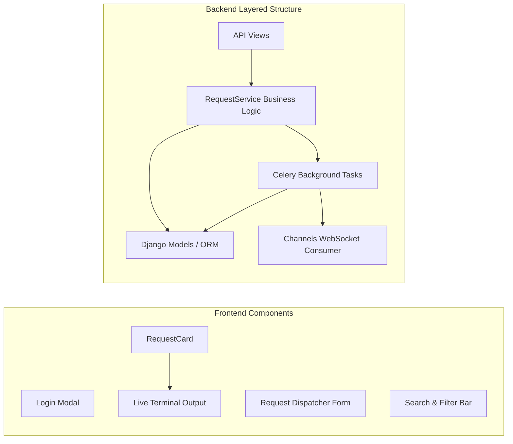
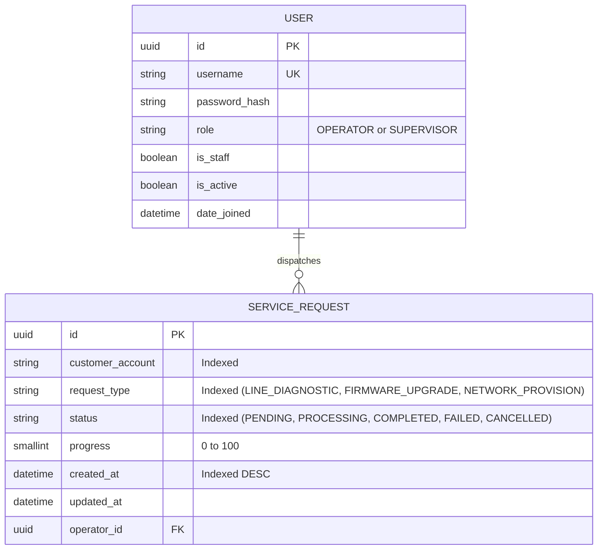
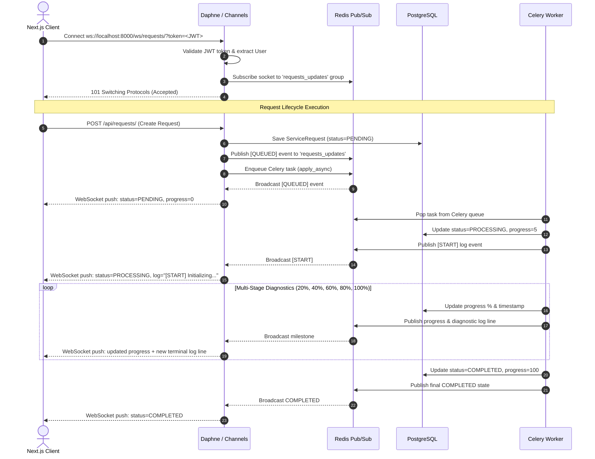

# System Design Document
## Real-Time Service Request Management System (NexusFiber Architecture)

---

## 1. High-Level Architecture
The system adopts an event-driven, decoupled client-server architecture composed of five primary tiers:
1. **Presentation Tier**: Next.js (App Router) client with Tailwind CSS, Framer Motion, and Zustand state store.
2. **Gateway / API Tier**: Django REST Framework (DRF) running under Daphne (ASGI) for unified HTTP and WebSocket handling.
3. **Event Broker & Pub/Sub**: Redis in-memory broker orchestrating asynchronous message passing.
4. **Asynchronous Execution Pool**: Celery distributed worker pool executing concurrent long-running diagnostics.
5. **Persistence Tier**: PostgreSQL relational database with index optimization.



---

## 2. Component Diagram


---

## 3. Database Design (Schema & ERD)

### Entity Relationship Diagram


### Table Specifications
- **`users_app_user`**: Custom user entity extending AbstractUser. Inherits Django authentication while introducing custom `role` enum (`OPERATOR`, `SUPERVISOR`).
- **`requests_app_servicerequest`**:
  - `id`: Primary key, auto-generated UUIDv4 preventing enumeration attacks.
  - `customer_account`: Varchar(50), indexed for fast lookup during text searches.
  - `request_type`: Varchar(30), constrained via `RequestType` enum choices.
  - `status`: Varchar(20), constrained via `Status` enum choices.
  - `progress`: PositiveSmallIntegerField (0-100).
  - `operator_id`: Foreign key to `users_app_user` with `ON DELETE CASCADE`.
  - `created_at`: Datetime with descending B-tree index for rapid chronological sorting.
  - `updated_at`: Datetime tracking state transitions.

---

## 4. API Design

The API adheres to RESTful conventions, supports optional trailing slashes seamlessly, and uses JWT Bearer tokens in the `Authorization` header.

| Method | Endpoint | Description | Auth Required | Permissions |
|---|---|---|---|---|
| `POST` | `/api/token/` | Obtain access & refresh token pair | Public | Anyone with valid credentials |
| `POST` | `/api/token/refresh/` | Refresh expired access token | Public | Valid refresh token |
| `GET` | `/api/requests/` | List service requests (paginated) | Bearer JWT | Operator sees own; Supervisor sees all |
| `POST` | `/api/requests/` | Submit new diagnostic service request | Bearer JWT | Authenticated Operator or Supervisor |
| `GET` | `/api/requests/{id}/` | Retrieve specific request details | Bearer JWT | Owner or Supervisor |
| `POST` | `/api/requests/{id}/cancel/` | Revoke background task & cancel request | Bearer JWT | Owner or Supervisor |

### Sample Payload: Create Request
```json
// POST /api/requests/
{
  "customer_account": "ACC-9482",
  "request_type": "LINE_DIAGNOSTIC"
}
```

### Sample Response: 201 Created
```json
{
  "id": "b98c8a17-fcff-45cf-9639-dfcf2033dfb1",
  "customer_account": "ACC-9482",
  "request_type": "LINE_DIAGNOSTIC",
  "status": "PENDING",
  "progress": 0,
  "operator_username": "operator1",
  "created_at": "2026-09-05T05:07:50.122091Z",
  "updated_at": "2026-09-05T05:07:50.122101Z"
}
```

---

## 5. WebSocket Communication Flow



---

## 6. Concurrency Model
1. **Asynchronous Non-Blocking Web Layer**:
   - Daphne runs an ASGI event loop capable of holding thousands of persistent WebSocket connections concurrently with negligible CPU/memory footprint.
2. **Dedicated Background Worker Pool**:
   - Celery operates a prefork worker pool (`--concurrency=4`).
   - Long-running operations simulate real-world physical latency (ICMP ping loss, SNR analysis, firmware flashing) without blocking the incoming API or WebSocket channels.
3. **Fair Dispatching via Prefetch Limitation**:
   - `CELERY_WORKER_PREFETCH_MULTIPLIER = 1` and `CELERY_TASK_ACKS_LATE = True` ensure tasks are distributed evenly across idle workers rather than monopolized by a single worker process.
4. **Immediate Task Revocation**:
   - The cancel flow leverages Celery's remote control broadcast (`app.control.revoke(task_id, terminate=True, signal='SIGKILL')`), abruptly halting the running subprocess and freeing the worker immediately.

---

## 7. Technology Stack Justification

| Layer | Selected Tech | Alternatives Considered | Rationale |
|---|---|---|---|
| **Frontend Framework** | **Next.js 16 (React 19)** | Plain React (Vite), Angular | Next.js App Router provides optimized compilation (Turbopack), server-driven routing, clean build artifacts, and enterprise-grade developer experience. |
| **Styling** | **Tailwind CSS v3** | CSS Modules, Styled Components | Utility-first CSS enables atomic styling for the dark minimalist NOC dashboard, ensuring consistent spacing, typography, and responsive breakpoints. |
| **State Management** | **Zustand** | Redux, Context API | Zustand provides minimal boilerplate, zero re-render overhead for rapid WebSocket updates, and native support for selective partial persistence. |
| **Animations** | **Framer Motion** | CSS Keyframes | Provides spring physics, layout animations, and exit transitions for smoothly reorganizing cards during real-time sorting and filtering. |
| **Backend Framework** | **Django 6 + DRF** | FastAPI, Express.js | Django provides an enterprise-ready ORM, built-in migration management, production admin portal, robust security middlewares, and seamless integration with Channels. |
| **Real-Time Protocol** | **Django Channels 4 (ASGI)** | Socket.io, Server-Sent Events (SSE) | Full duplex WebSocket communication allows bi-directional communication, native Redis channel layering, and unified authentication with Django’s user model. |
| **Task Queue** | **Celery 5.6** | RQ, BackgroundTasks | Industry standard for distributed task execution in Python; provides worker prefork pools, remote task revocation, retries, and comprehensive monitoring. |
| **Broker / In-Memory** | **Redis 7** | RabbitMQ, Kafka | Lightweight, blazing fast in-memory store that simultaneously serves as the Celery task broker and the Django Channels pub/sub distributed channel layer. |
| **Database** | **PostgreSQL 15** | MySQL, SQLite | Robust ACID compliance, native UUID support, advanced indexing, and proven reliability for concurrent read/write workloads. |
| **Containerization** | **Docker Compose** | Bare Metal, Podman | One-command orchestration (`docker-compose up --build`) ensuring 100% reproducible environments across developer machines and evaluation reviewers. |
